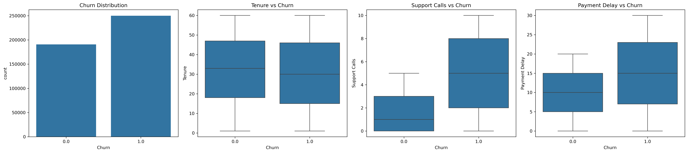
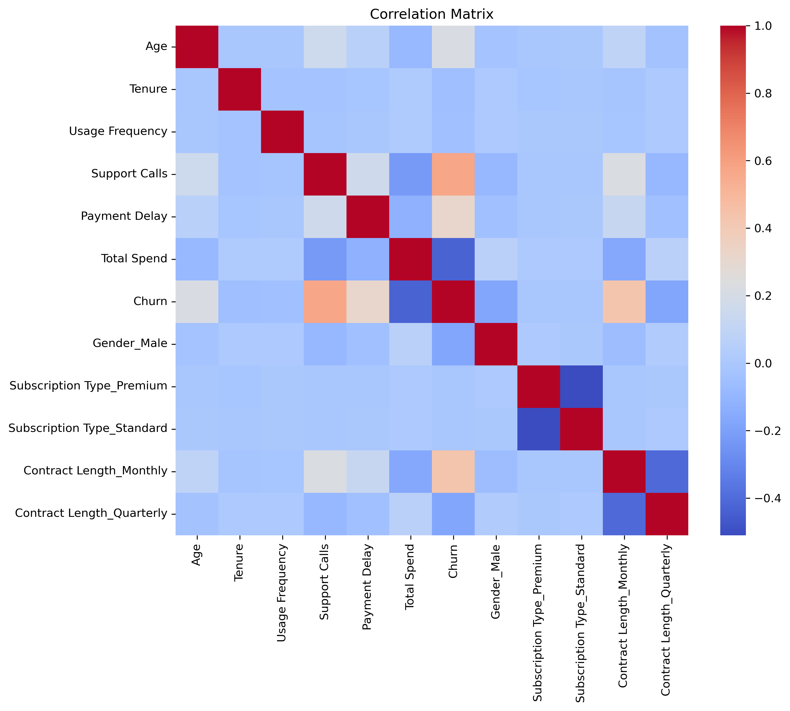
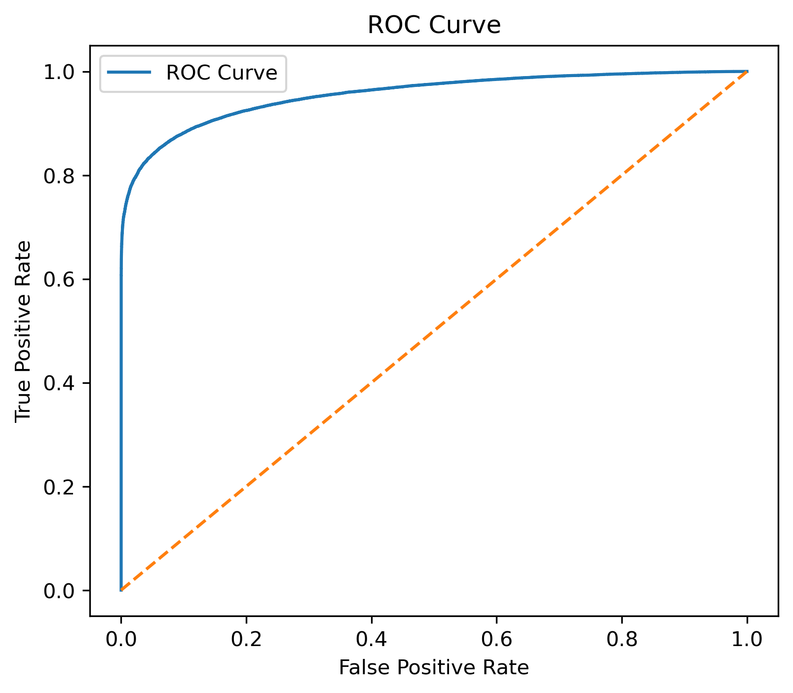
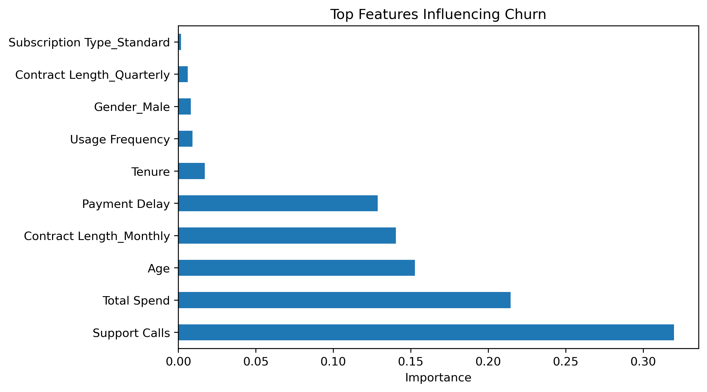

# 📊 Customer Churn Prediction

## 📌 Problem Statement

Customer churn is a major challenge for businesses as it directly impacts revenue and growth.
The goal of this project is to build a machine learning model that predicts whether a customer will churn based on their behavior and usage patterns.

---

## 📂 Dataset

The dataset contains customer information such as:

* Age
* Gender
* Tenure
* Usage Frequency
* Support Calls
* Payment Delay
* Subscription Type
* Contract Length
* Total Spend

Target variable:

* **Churn (0 = No, 1 = Yes)**

---

## ⚙️ Approach

### 🔹 Data Preprocessing

* Removed irrelevant columns (`CustomerID`, `Last Interaction`)
* Handled missing values
* Encoded categorical variables using one-hot encoding
* Scaled numerical features using StandardScaler

---

### 🔹 Exploratory Data Analysis (EDA)

Performed visualization to understand customer behavior:

Key observations:

* Customers with **low tenure** are more likely to churn
* Higher **support calls** indicate dissatisfaction and higher churn
* **Payment delays** are strongly associated with churn
* Monthly contract users have higher churn compared to long-term plans

---

### 🔹 Correlation Analysis

* **Support Calls** showed the strongest positive correlation with churn
* **Payment Delay** and **Monthly Contracts** also contributed to higher churn
* **Total Spend** had a negative correlation, indicating loyal high-value customers

---

## 🤖 Models Used

### 1. Logistic Regression

* Baseline model
* Accuracy: **~89%**
* Provides interpretability and stable performance

### 2. Random Forest Classifier

* Ensemble model capturing non-linear patterns
* Accuracy: **~99%**
* Significantly higher predictive power

---

## 📈 Model Evaluation

### Logistic Regression

* Accuracy: **0.89**
* Balanced precision and recall
* Reliable baseline model

### Random Forest

* Accuracy: **0.99**
* Very high performance, but potential risk of overfitting
* Further validated using cross-validation

---

## 📊 Sample Outputs

### 🔹 Exploratory Data Analysis (EDA)



*EDA showing key patterns such as tenure, support calls, and payment delay influencing churn.*

---

### 🔹 Correlation Heatmap



*Correlation analysis highlighting relationships between features and churn.*

---

### 🔹 ROC Curve



*ROC curve demonstrating model performance and classification capability.*

---

### 🔹 Feature Importance



*Top features influencing churn prediction based on Random Forest model.*

---

## 📊 Key Insights

* Customers with **frequent support calls** are highly likely to churn
* **Low tenure customers** are at higher risk
* **Payment delays** indicate dissatisfaction and increase churn probability
* Customers on **monthly contracts** are more likely to leave
* High spending customers are **less likely to churn**

---

## 💡 Business Impact

This model helps businesses:

* Identify high-risk customers in advance
* Take proactive retention actions
* Improve customer satisfaction

📌 Estimated impact:

* Can help reduce churn by **15–20%** through targeted strategies

---

## 🚀 Future Improvements

* Hyperparameter tuning for better generalization
* Deploy model using Streamlit / Flask
* Use advanced models like XGBoost
* Handle class imbalance (if present)

---

## 🛠️ Tech Stack

* Python
* Pandas, NumPy
* Matplotlib, Seaborn
* Scikit-learn

---

## 📌 Conclusion

A machine learning-based churn prediction system was developed using Logistic Regression and Random Forest.
Random Forest achieved superior performance by capturing complex patterns, while EDA and correlation analysis provided actionable business insights.

---

## 📬 Author

**Sai Datta Srinath**

---

## ▶️ How to Run

1. Clone the repository
2. Install dependencies
3. Open the notebook
4. Run all cells

```bash
pip install pandas numpy scikit-learn matplotlib seaborn
```
